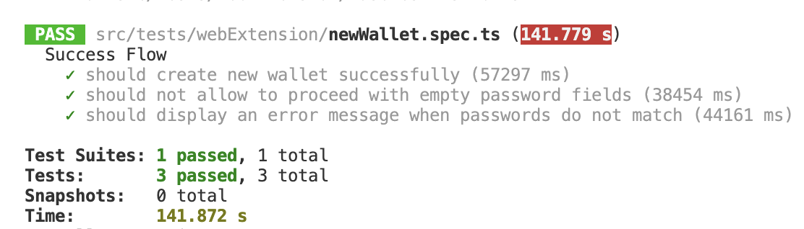

### Application FLow: 

Welcome screen -> Create a new wallet -> Set and confirm Password screen -> Backup
your secret phrase screen -> your secret phrase screen -> confirm secret phrase ->
success screen -> click ‘open wallet’ and new user tips in home screen display.

### Test Plan : 

### Objective: 
To test the flow from the welcome screen to successfully opening the wallet with new user tips displayed on the home screen

Here's the list of all functional E2E cases:

| **Test Case ID** | **Test Case Description** | **Preconditions** | **Test Steps** | **Expected Result** | **Status** |
|------------------|--------------------------|-------------------|----------------|---------------------|------------|
| TC001 | End-to-End Positive Flow Test | App installed and launched | 1. Verify Welcome Screen elements. 2. Tap on "Create New Wallet" button. 3. Enter a valid password and confirm it. 4. Write down the secret phrase. 5. Confirm the secret phrase. 6. Tap "Open Wallet" button. 7. Verify new user tips on the home screen. | The wallet is successfully created, and new user tips are displayed on the home screen. | Partial executed |
| TC002 | Negative Flow: Empty Password | App installed and launched | 1. Tap "Create New Wallet" button. 2. Leave the password fields empty. 3. Tap "Confirm" button. | next button should be disabled | passed |
| TC003 | Negative Flow: Password Mismatch | App installed and launched | 1. Tap "Create New Wallet" button. 2. Enter a password and a different confirmation password. 3. next button should be disabled | App displays an error message indicating that the passwords do not match. | passed |
| TC004 | Negative Flow: Weak Password | App installed and launched | 1. Tap "Create New Wallet" button. 2. Enter a weak password and confirm it. 3. Tap "Confirm" button. | App displays an error message indicating that the password is too weak. | Not Executed |
| TC005 | Negative Flow: Incorrect Secret Phrase | App installed and launched | 1. Complete the password setup. 2. Write down an incorrect secret phrase. 3. Confirm the incorrect secret phrase. 4. Tap "Confirm" button. | App displays an error message indicating that the secret phrases do not match. | Not Executed |
| TC006 | Negative Flow: Incorrect Secret Phrase Confirmation | App installed and launched | 1. Complete the password setup. 2. Write down the secret phrase. 3. Confirm the secret phrase with an incorrect confirmation. 4. Tap "Confirm" button. | App displays an error message indicating that the secret phrase confirmation is incorrect. | Not Executed |
| TC007 | Negative Flow: Incorrect Order of Secret Phrase | App installed and launched | 1. Complete the password setup. 2. Write down the secret phrase. 3. Enter the correct secret phrase in the incorrect order. 4. Tap "Confirm" button. | App displays an error message indicating that the secret phrases do not match. | Not Executed |
| TC008 | Negative Flow: Incorrect Secret Phrase Confirmation Order | App installed and launched | 1. Complete the password setup. 2. Write down the secret phrase. 3. Confirm the secret phrase in the incorrect order. 4. Tap "Confirm" button. | App displays an error message indicating that the secret phrases do not match. | Not Executed |
| TC009 | Edge Case: Maximum Password Length | App installed and launched | 1. Tap "Create New Wallet" button. 2. Enter a password of maximum allowed length. 3. Confirm the password. 4. Tap "Confirm" button. | The password is successfully set and confirmed. | Not Executed |

### Tools & Framework: 

| **Tools & Framework** | **Automation Framework** | **Test Framework** | **Programming Language** | **Comments** |
|----------------------|-------------------------|--------------------|-------------------------|--------------|
| Web-Extension Automation | Selenium | Jest | Typescript | Since Selenium is most popular tool for web-extension. |
| Android Mobile-App Automation | Appium | testNG | Kotlin | Since Appium is most popular tool for Android App Automation. I created using kotlin because javascript needed an experience with webdriverio which I don't have much yet. |

### Test Result: 

Please note that 1st test is partial complete because I couldn't not finish the functionality to extract clipboard content for secret phrase.

